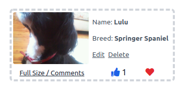
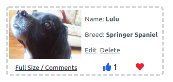

# Hot Dogz


## Project Outline

- This project aims to build a full-stack web application using the python micro-framework Flask, MongoDB database, Tailwind CSS & JavaScript
- The app is a photo sharing app where dog owners can post photos of their dogs, or dog lovers can visit and upvote/favourite photos of dogs uploaded to the site
- This application features a main photo gallery section, an upvote/like feature, user signup and login and customiseable user accounts.


## Live project

**[View the live project here](https://hot-dogz.herokuapp.com)**


## Table of Contents

  * [User experience](#user-experience)
    + [User Stories](#user-stories)
    + [Wireframes](#wireframes)
      - [Changes from Wireframes](#changes-from-wireframes)
  * [Database Models and Schema](#database-models-and-schema)
    + [Database Models](#database-models)
    + [Database Schema](#database-schema)
    + [MongoDb](#mongodb)
  * [Design](#design)
    + [Colour Scheme](#colour-scheme)
    + [Typography](#typography)
  * [Features](#features)
    + [Main](#main)
      - [Landing page](#landing-page)
      - [Gallery page.](#gallery-page)
      - [Navigation](#navigation)
      - [Contact page.](#contact-page)
    + [User Pages](#user-pages)
      - [Register / Login](#register---login)
      - [Password Change Request](#password-change-request)
      - [Profile](#profile)
    + [Dog Pages](#dog-pages)
      - [Dog Profile Page](#dog-profile-page)
      - [Comments](#comments)
    + [Admin](#admin)
    + [Custom Error Pages](#custom-error-pages)
    + [Features left to Implement.](#features-left-to-implement)
  * [Technologies used.](#technologies-used)
    + [Flask](#flask)
      - [Flask extensions used](#flask-extensions-used)
    + [TailwindCSS](#tailwindcss)
    + [Cloudinary](#cloudinary)
      - [Cloudinary Upload API](#cloudinary-upload-api)
      - [Cloudinary Transformation URL API](#cloudinary-transformation-url-api)
    + [Other Tools, Libraries & Programs](#other-tools--libraries---programs)
  * [Testing](#testing)
  * [Deployment](#deployment)
    + [Requirements To Deploy:](#requirements-to-deploy-)
    + [Cloning This Project:](#cloning-this-project-)
      - [To Work With Your Local Clone:](#to-work-with-your-local-clone-)
    + [Deploying To Heroku](#deploying-to-heroku)
      - [Create a procfile:](#create-a-procfile-)
      - [For Deployment:](#for-deployment-)
  * [Credits](#credits)
    + [Code](#code)
    + [Content](#content)

<small><a href='http://ecotrust-canada.github.io/markdown-toc/'>Table of contents generated with markdown-toc</a></small>

## User experience

### User Stories

- New Visitor

  - I want to see the content of the website without being forced to register first
  - I would like to easily register for the site.
  - I would like to be able to like and favourite photos on the site and easily understand how this system works
  - I would like to be able to comment on photos
  - I would like to add my own dogs to the site

- Repeat users

  - I would like to easily login upon opening the site.
  - I would like to see my saved favourites and previous uploads
  - I would like to be able to edit/delete my comments
  - I would like to edit and delete my posts.
  - I would like to be able to edit and delete my account

-  All users.

   - I would like to get feedback when I have completed an action on the site.
   - I would like to be able to contact the website owners

- Website owner

  - I want the website to be fun and enjoyable for the user
  - I want the user to be able to sign up or log in easily
  - I want users to be able to easily recover their account if they have lost their login details
  - I only want users to be able to edit/delete their own content
  - I want the ability as admin to delete/edit any content that is inappropriate

### Wireframes

- [Mobile Wireframes](docs/wireframes/mobile.pdf)
- [Desktop Wireframes](docs/wireframes/desktop.pdf)
- (Tablet design planned to follow same layout as mobile)

#### Changes from Wireframes

There were some changes from the initial wireframes, some of which were stylistic, some due to learning more about the technologies being used create the app, and some due to reducing complexity to achieve a minimum viable product.

1. On mobile, a bottom navigation bar was implemented when users were logged in
2. Pagination buttons were replaced with clickable page numbers rather than 'Previous' and 'Next' buttons
3. The original aim of the app was to have three categories for the main gallery, similar to a reddit style ranking system
	- Hot: Dogs with the most recent upvotes
	- New: Most recently uploaded dogs
	- Top: Dogs with the most all-time upvotes
Due to certain complexities involved in this, particularly taking into account that the app may not have regular uploads, to achieve a minimum viable product I decided to go with just 'Hot' (most liked of all time) and 'New' (newly uploaded dogs) for the app.
4. Similarly, in order to achieve a MVP, breed selection was kept to one select item, with an option for mixed-breed included in the options.
5. Images were used for some form pages, but not for the login/register page as outlined in the app which were kept clean
6. In desktop view, 'My Dogs' and 'Favourites' were originally positioned side by side, however in practice - as a user would likely have much more favourites than uploads, to these were kept one above the other is it provided a more balanced layout.

## Database Models and Schema

### Database Models
- The database consists of four collections - User, Breed, Dog, Comment
- User
	- This contains user's username, email address, hashed password string and avatar selection
	- The user ID acts as a reference field in various other collections
- Breed
	- This acts as a reference field for the Dog collection and contains a lists of breeds that users can choose from when uploading their dog
- Dog
	- This contains the basic dog information; name, about section, upload date
	- Dog breed is referenced as noted above
	- Dog owner referenced User ID and is automatically set to the user that uploads the Dog item
	- liked_by and faved_by are both one to many reference field lists, referencing IDs of Users that have favourited or liked a dog
	- img_url is the users uploaded image of a dog
		- img_url_card is the above image with transformations setting height to 350px, width to 525px, low quality on the image and automatically focusing on key part of image using cloudinary API
		- img_card_thumb is also optimized to lower quality and limited to a width of 500px (height remains at auto) 
	- upload_date is an automatically added datetime item
- Comment
	- autor references the User.id that created the comment
	- dog references the Dog.id of the dog page the comment is attached to
	- content is text input of comment and datetime is another automatically added datetime item

### Database Schema


### MongoDb

- mongodb was used as the project database.

- I followed the following steps to set it up.
	- signed up to Mongodb and created a shared cluster
	- selected default AWS cloud provider
	- selected Ireland region
	- selected m0 cluster tier
	- chose name for cluster
	- once cluster was created I clicked 'CONNECT' button
	- Selected 'connect your application'
	- selected Python / 3.6 or later as my driver
	- copied the connection string for use in my application
	- set password / cluster name / collection name as enviuronmental variables to connect to my DB within flask
	- used Flask-MongoEngine to interact with my DB within the app

## Design

### Colour Scheme

- The app's primary color was based on the pawprint logo colour [found on the mobile phone in the main landing page image](https://res.cloudinary.com/cjcon90/image/upload/v1615248344/hot_dogz/wallpapers/dog4_crop.jpg) (#cf5551)
- This colour was darkened slightly for use as the primary colour in the app to ensure there was proper contrast on all text/buttons
- I then used the [Adobe color wheel](https://color.adobe.com/create/color-wheel) to find a complimentary colour that also offered good contrast for white backgrounds and text
- Different shades of the primary and secondary colours were created with [Tailwind Shades](https://www.tailwindshades.com) and added via the `tailwind.config.js`
- For borders I used a mid-light gray (Tailwind color *gray-400*) matching the original design in the wireframes
- For the bottom navbar and footer I used a dark charcoal gray (Tailwind color *gray-700*) 


### Typography

I used three fonts throughout the website. A display font on the welcome page, and the traditional pairing of a serif heading font with sans serif body text font.

- Landing Page Title
	- For the landing page I chose [Lobster](https://fonts.google.com/specimen/Lobster?preview.text_type=custom), a fun and recognizable display font that paired nicely with the main sans font underneath
- Headings
	- Headings throughout the site use [Crete Round](https://fonts.google.com/specimen/Crete+Round?preview.text_type=custom#standard-styles), a contemporary serif font
- Body font
	- All other text and paragraphs are using [Lato](https://fonts.google.com/specimen/Lato?preview.text_type=custom) a modern and popular sans-serif font


## Features

### Main

#### Landing page

- If user's are not signed in, then they are greeted with a fun landing page
- There are clear links to the main gallery and login & register pages
- Landing page redirects to the main gallery if users are already signed in
- The footer is viewable on scroll, but initially hidden off screen to focus the user on the main landing page design and image 
	
#### Gallery page.
-  Gallery page shows six uploaded dogs per page
-  Pagination buttons are below pictures to easily navigate between pages
-  Options to view highest rated or newly uploaded dogs
-  Default view is to show the most popular dogs
-  Clear distinction between 'Hot' and 'New' depending on which page the user is on
-  There is a different wallpaper depending on whether yo are on Hot or New
-  Each dog card on the gallery page contains links to:
	- Like the dog
	- Favourite the dog
	- See the dog's main page with larger picture
	- Link to the person who uploaded the dog (if you are not the uploader)
	- Links to delete or edit the dog, if you are the uploader 
- There is a large button at the bottom of the gallery to upload a new dog 

#### Navigation

- There are two different navigations, depending on whether you are on mobile or tablet+
- On mobile there is a bottom navigation bar, making it easy to access the main links with your thumb (visible once the user has signed in)
- The top mobile navigation simply consists of a 'My Profile' button (or Login/Register buttons if a user has not yet signed in)

- On desktop, the links that are present in the mobile bottom navigation are instead added alongside the 'My Profile' button in the top navigation bar


#### Contact page.

- If user is not logged in:
	- Form has fillable Name/Email/Message fields
- If user is logged in
	- Form has read-only, pre-filled username/email fields for current user
	- Has fillable message form
- All messages sent from contact form send messages to my own email    

### User Pages

#### Register / Login

- Both the Register and Login pages have a simple, clean form asking for username / password
- Register form asks for email and password confirmation
- Both pages link to eachother if user is already registered / not regisatered yet
- Both pages link to contact page
- Login page links to a password reset page, if user has forgotten their login password

#### Password Change Request

- Request page features a single email field for users to request a password reset link
- Feedback is given to check your email regardless of whether it is a registered email or not for security reasons (not identifying whether an email is regisatered or not)
- If it is a registered email, a link with a JWT token is sent to the user's email
- This link leads to a Password Change form with two password fields to type and confirm the users new password

#### Profile

- Displays this user's chosen avatar
- Displays any dogs this user has uploaded
- Displays any dogs this user has favourited
- If this user is the current user, it presents links to:
	- Change your avatar
		- Here you can choose from 16 dog themed user avatars
	- Edit your account
		- Here you can change your username or email 
	- Delete your account 
		- Presents a screen to confirm your password in order to delete your account, along with any of your uploaded dogs/comments

### Dog Pages

#### Dog Profile Page

- Displays a larger thumbnail image of dog, without cropping to card aspect ratio
	- This image features a link to see original, user upload full-size image
- Display's dog info: name, breed, upload date, owner and about section
- If current user is dog's owner, then displays buttons to edit or delete dog
	- Edit dog will load a form with any information pre-filled
	- Uploading a new profile picture will replace the previous picture in the Hot Dogz cloudinary database
	- Delete dog will ask user's to confirm before deletion 
- Otherwise displays text prompting current user to leave a comment   

#### Comments

- Displays avatar of comment author and name, both of which act as a link to their user page
- Displays comment content and date comment was added
- If current user is author, it displays edit and delete comment buttons
	- Edit comment will navigate to a text entry, pre-filled witih the comment user is editing
	- Delete comment will display the comment text as a blockquote and ask user to confirm delete

### Admin

- There is an admin user account which has permissions to delete or edit any user, dog or comment on the site
- A preview of the admin account on the gallery home page will show edit/delete options for all uploaded dogs, which are normally hidden unless dog owner is the current user:

- Links for deleting/editing comments and users are also shown in this way for admins.

### Custom Error Pages

- I have created an error pages using the flask app_error handlers
- Each page contains a reason for the error and a navigation link to return to the previous page, along with a humourous image of a sad bulldog in a dress. Errors are:
	- 404 - not found an error
	- 403 - no permission error
	- 500 - server error.

### Features left to Implement.

- Creating a new view called 'Top' which replaces the current implementation of 'Hot', and instead having 'Hot' display recently upvoted / trending dog photos
- Filtering dogs by breed (would be most useful if the site was popular and there was a lot of posts)
- Possibly future improvement would be to separate the front end and the back end by having Flask act as an API and use a JavaScript framework for the front end. This would have reactivity benefits, such as the page not having to refresh every time a user likes/favourites a photo.

## Technologies used.

### Flask

- The application was built on the Flask framework. 
- I followed [Corey Schafer's guide on YouTube](https://www.youtube.com/watch?v=Wfx4YBzg16s) in using Flask Blueprints to split my application up itno the following modules:
	- main
	- users
	- dogs
	- errors
- This makes it easier to find routes and elements if they need to be updated or changed.
- The templates folder is also split into a similar structure.
	- base.html 
	- /main
	- /user
	- /dog
	- /email
	- /errors
- App configuration settings are contained within ``` config.py ```
- Inside the  ```__init__.py ``` file I've created the app as a [Flask application factory](https://flask.palletsprojects.com/en/1.1.x/patterns/appfactories/).
- Then in the ``` app.py ``` file, the application factory is imported and the function is the invoked ie. ``` app = create_app() ``` which creates the application.

#### Flask extensions used

- [Flask](https://flask.palletsprojects.com/en/1.1.x/)
	- Flask micro framework was used to build the web app using python code.

- [Flask-login](https://flask-login.readthedocs.io/en/latest/)
	- Flask login was used to manage logged in users.

- [Werkzeug](https://werkzeug.palletsprojects.com/en/1.0.x/utils/#module-werkzeug.security)
	- Werkzeug Security Helpers were used to hash the user passwords before storing in the database

- [Flask-Mail](https://flask-login.readthedocs.io/en/latest/)
	- For sending emails relating to the contact and password reset forms
		- For the Heroku deployment, I used the Heroku Sendgrid extension instead, as Flask-Mail was giving me the error `SMTP AUTH extension not supported by server`, although it worked locally.

- [Flask-Mongoengine](http://docs.mongoengine.org/projects/flask-mongoengine/en/latest/)
	- For interacting with the MongoDB database

- [Flask-Wtf](https://flask-wtf.readthedocs.io/en/stable/)
	- For creating forms and adding validation

- [Gunicorn](https://gunicorn.org/)
	- To help deploy the app to Heroku

### TailwindCSS

- [TailwindCSS](https://tailwindcss.com/docs) was used extensively as the primary method of styling the application
- I installed Tailwind by initialising an NPM package within my static folder with `npm init`
- I then ran the following NPM installs within the terminal: `npm install -D tailwindcss@latest postcss@latest autoprefixer@latest postcss-cli` to install the necessary dependencies
- I ran `npx tailwindcss init -p` to create both my tailwind and postcss config files 
- I created two .css files - app.css & compiled.css
- Within app.css I placed the tailwind directives to inject Tailwind's styles into the CSS file:
```
@tailwind base;
@tailwind components;
@tailwind utilities;
```
- I then included a PostCSS command wihtin my package.json to compile the Tailwind libraries into a usable CSS file: `"build:css": "postcss css/app.css -o css/output.css"`
	- Any time that I made custom CSS changes or additions within my app.css or tailwind.config.js files, I would run this command to recompile my CSS file and then complete a hard refresh within my browser to update the changes
- Before deploying the site to Heroku, I ensured that `purge` was set to `true` within my tailwind.config.js file. This ensures that only the necessary classes are compiled in the final CSS file used by my web page, minimising the amount of CSS that the browser has to load as much as possible.

### Cloudinary

#### Cloudinary Upload API

- In adding user images to the website, I utilised the [Cloudinary Upload API](https://cloudinary.com/documentation/image_upload_api_reference)
- Within my Cloudinary account, I set up a hot_dogz folder.
- Within my Dog model I added a method to save uploaded user images into this folder under the format `hot_dogz/{user}/{pk}`
	- All of of a user's dogs would be saved within one folder, named after the user's username
	- Each dog's photo would be named after it's primary key
- If a user delete's a dog or delete's their profile, then the dog image is deleted from the cloudinary database using the built-in `uploader.destroy()` method. 

#### Cloudinary Transformation URL API

- Within each Dog collection, I added two additional image URLs which utlised the Cloudinary transformation API. These make on-the-fly changes in how the image is rendered on the web page.
	- One URL for displaying image thumbnails on the dog's profile page
	- One URL for displaying at a fixed aspect ratio within the dog card component
- For the `img_url_thumb` i added the transformations: `w_500,c_scale,q_auto:low`
	- Width: 500px
	- Crop: scale
	- Auto render in low quality for smaller file size  
	- These transformations dramatically reduce file size. Here is an example file size difference between clicking on the original full-size image vs what is rendered on a dog's profile page (from 2.95MB to 21.85kb)
		- [Before transformations](docs/screenshots/trans_before.png)
		- [After transformations](docs/screenshots/trans_after.png)

- For the `img_url_card` I wanted images to be a fixed size of 350px x 525px, so I used the transformations `c_fill,g_auto,h_350,w_525,q_auto:low`
	- Crop is set to fill
	- `g_auto` = Gravity set to 'auto'. The 'gravity' transformation determines which part of an image to focus on and decides where a crop should be made
	- Setting it to 'auto' leaves Cloudinary's AI decide where to crop the image, which generally focuses on a dog's face. An example can be seen here:

**Without gravity**:

**With gravity set to 'auto'**: 



### Other Tools, Libraries & Programs

- [Font Awesome](https://fontawesome.com) - For icons used throughout the site
- [GIMP - GNU Image Manipulation Program](https://www.gimp.org) - For image editing
- [favicon.io](https://favicon.io) - For creating favicon .ico
- [Google Fonts](https://fonts.google.com) - for importing chosen fonts
- [Balsamiq](https://balsamiq.com) - For creating my wireframes
- [QuickDBD](https://app.quickdatabasediagrams.com) - For creating my DB schema diagram
- [Am I Responsive?](http://ami.responsivedesign.is) - For creating the mockup image at start of README
- [VSCode](https://code.visualstudio.com) - My primary code editor of choice for the project
- [PyCharm](https://www.jetbrains.com/pycharm/) - Secondary code editor, used particularly for additional PEP 8 compliance functionality

## Testing

**[Please see TESTING.md](TESTING.md)**

## Deployment

### Requirements To Deploy:
- Python3
- Github account
- MongoDB account
- Heroku account

### Cloning This Project:
To create a clone, follow the following steps.

1. Log in to GitHub and go to the repository.
2. Click on the button with the text “Code”.
3. Click “Open with GitHub Desktop” and follow the prompts in the GitHub Desktop Application or follow the instructions from [GitHub](https://docs.github.com/en/free-pro-team@latest/github/creating-cloning-and-archiving-repositories/cloning-a-repository#cloning-a-repository-to-github-desktop) to see how to clone the repository in other ways.

#### To Work With Your Local Clone:
1. Install all the requirements:
	- Go to the workspace of your local copy.
	- create a virtual environment with `python3 -m venv venv`
	- Activate your virtual environment with `source venv/bin/activate`
	- Install requirements from requirements.txt file with `pip install -r requirements.txt`

2. Create your database in MongoDB.
    1. Signup Or Login For [MongoDB](https://www.mongodb.com/)
    2. Create a cluster as well as a database.
    3. Create the following collections in the Database:
        1. breed
        2. comment
        3. dog
        4. user
3. Create a file in the root directory called ".flaskenv". This will contain all of your envornment variables. Your .flaskenv file should look similar to the following:
```
FLASK_APP=run.py
FLASK_DEBUG=[0 for off, 1 if you want to run flask debug mode locally]
SECRET_KEY=[random string]
MONGO_URI=mongodb+srv://[mongoDBusername]:[mongoDB password]@[clustername].wijab.mongodb.net/[database name]?retryWrites=true&w=majority
MONGO_DBNAME=[mongoDB database name]
CLOUD_NAME=[cloudinary username]
CLOUD_API_KEY=[cloudinary API key]
CLOUD_API_SECRET=[cloudinary API secret key]
CLOUDINARY_URL=[cloudinary connection URL]
MAIL_SERVER=[your mail smtp string, i.e. 'smtp.googlemail.com' if using gmail]
MAIL_PORT=[587 if using TLS, 465 if using SSL]
MAIL_USE_TLS=[1 if true, 0 if false (if false then set MAIL_USE_SSL=1 instead)]
MAIL_USERNAME=[email username, i.e. #####@gmail.com]
MAIL_PASSWORD=[login password for email]
```
4. Make sure that .flaskenv is included in your .gitignore file. It should be included already in cloned file
5. To read your environment variables from your .flaskenv file, you must ensure that you have installed Python-dotenv within your virtual environment: `pip install python-dotenv`. This should have alreayd happened when installing requirements earlier

### Deploying To Heroku

To deploy our application on Heroku, we are required to have a requirements.txt file as well as a Procfile. These files will allow Heroku understand 
what dependencies are required to run the application, as well as tell Heroku which file to run, to launch the application.

#### Create a procfile:
- Within your root folder, type in the terminal `touch Procfile` to create the Procfile
- In your IDE, insert the text `web: gunicorn run:app` in your Procfile and save
	- gunicorn should have been installed via pip earlier 

#### For Deployment:
1. Open [Heroku](http://heroku.com/).
2. Login or signup for Heroku.
3. Once logged in create a new app and select the desired region. 
4. Deployment method "GitHub" (if this section is accidentally missed, you can use the tab selection within your dashboard "DEPLOY")
5. Select "connect to GitHub" and follow the on screen instructions. Once connected to your Github:
   
    - Search for your repository using the form provided.
6. Once you have connected your GitHub repository:
    - Navigate to the "Settings" tab:
        - Scroll to the section "Config Vars" here you will have to tell Heroku what these variables are:
            - Input all data found in .flaskenv file into the config var section
    - Navigate back to the "Deploy" tab:
        - Scroll to the "Manual Deploy" tab:
            1. Select the branch you wish to deploy (master is default)
            2. Click the "Deploy Branch" button. (This may take some time as Heroku uploads the app to their servers.) 

- Once the build is complete, a "View App" button will appear just below the build progress box. You can click this to see immediately if the build was successful. If the app doesn't load first time, try refresh once prior to investigating further.

- Common issues include outdated requirements.txt and/or missing Procfile, if errors occur, check these are both correct before investigating further


## Credits

### Code

- My navbar designed was inspired by [this post on TailwindComponents by sebageounity](https://tailwindcomponents.com/component/bottom-and-header-nav-responsive)
- Form design was inspired by [this post on TailwindComponents by darkcris1](https://tailwindcomponents.com/component/facebook-login-page)
- Most of my Flask code and knowledge was inspired by Miguel Grinberg's [Flask Mega-Tutorial](https://blog.miguelgrinberg.com/post/the-flask-mega-tutorial-part-i-hello-world)
- Flask knowledge was also supplemented by Corey Schafer's [Python Flask Tutorial on YouTube](https://www.youtube.com/watch?v=MwZwr5Tvyxo&list=PL-osiE80TeTs4UjLw5MM6OjgkjFeUxCYH), particularly the [use of Blueprints](https://www.youtube.com/watch?v=Wfx4YBzg16s&list=PL-osiE80TeTs4UjLw5MM6OjgkjFeUxCYH&index=11)

### Content

- Dog avatars sourced from [freepik](https://www.freepik.com/free-vector/different-dog-faces-collection_905468.htm)
- Pug photos were sourced from [Burst by artist Matthew Henry](https://burst.shopify.com/@matthew_henry)
- Other dog wallpapers were sourced from Shutterstock (via a Premium subscription for 1 month)
	- [WildStrawberry](https://www.shutterstock.com/image-photo/dog-clothes-skier-fur-jacket-glasses-796792303)
	- [Javier Brosch](https://www.shutterstock.com/image-photo/chic-fashionable-diva-luxury-cool-dog-478163164)
	- [Javier Brosch 2](https://www.shutterstock.com/image-photo/cool-trendy-posing-french-bulldog-sunglasses-713809558)
	- [Eric Isselee](https://www.shutterstock.com/image-photo/group-chihuahuas-dressed-wearing-glasses-bow-324845963)
	- [WilleeCole Photography](https://www.shutterstock.com/image-photo/spoiled-dog-english-bulldog-dressed-like-87110962)
- Breed list was taken from this list of [Top 100 dog breeds in the UK](https://www.mirror.co.uk/tv/tv-news/uk-best-dog-breeds-2019-13923931)