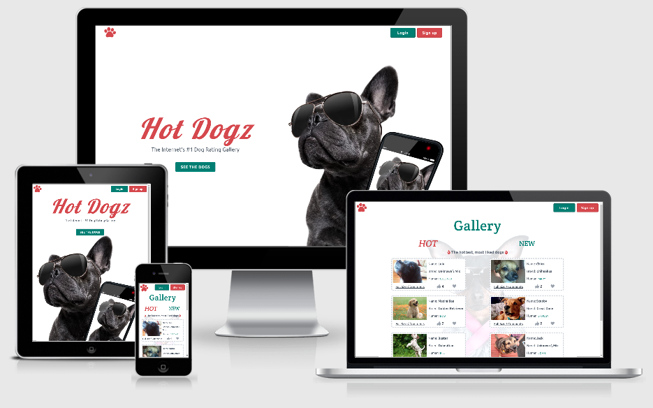
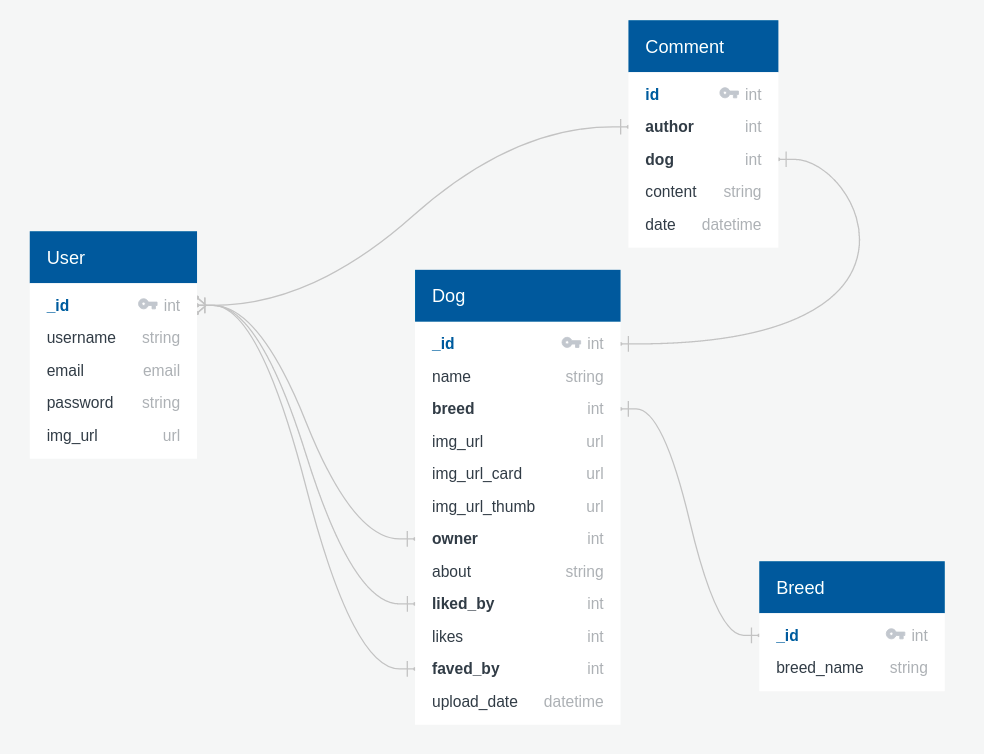
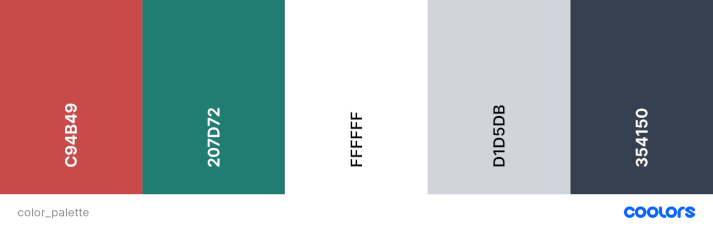
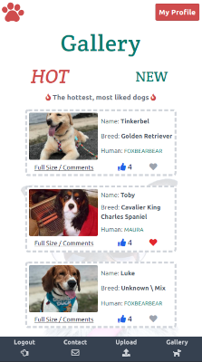
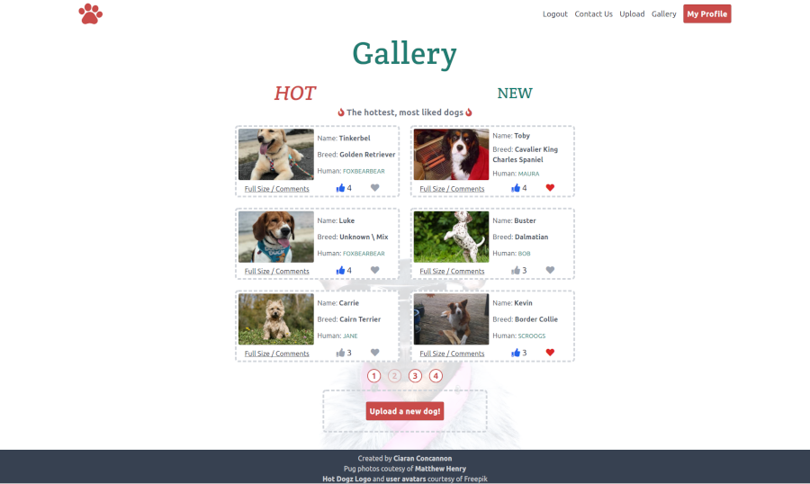
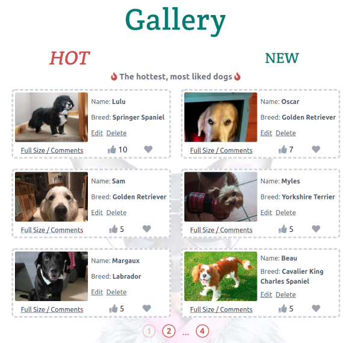

# Hot Dogz

## Milestone Project 3

- This project aims to build a full-stack web application using the python micro-framework Flask, MongoDB database, Tailwind CSS & JavaScript
- This app is a photo sharing app where dog owners can post photos of their dogs, or dog lovers can visit and upvote/favourite photos of dogs uploaded to the site
- This application features a main photo gallery section, an upvote/like feature, user signup and login and customiseable user accounts.

## Live project

[View the live project here](https://hot-dogz.herokuapp.com)

## Table of Contents

## User experience

### User Stories

- New Visitor

  - I want to see the content of the website without being forced to register first
  - I would like to easily register for the site.
  - I would like to be able to like and favourite photos on the site and easily understand how this system works
  - I would like to be able to comment on photos
  - I would like to add my own dogs to the site

- Repeat users

  - I would like to easily login upon opening the site.
  - I would like to see my saved favourites and previous uploads
  - I would like to be able to edit/delete my comments
  - I would like to edit and delete my posts.
  - I would like to be able to edit and delete my account

-  All users.

   - I would like to get feedback when I have completed an action on the site.
   - I would like to be able to contact the website owners

- Website owner

  - I want the website to be fun and enjoyable for the user
  - I want the user to be able to sign up or log in easily
  - I want users to be able to easily recover their account if they have lost their login details
  - I only want users to be able to edit/delete their own content
  - I want the ability as admin to delete/edit any content that is inappropriate

### Wireframes

- [Mobile Wireframes](docs/wireframes/mobile.pdf)
- [Desktop Wireframes](docs/wireframes/desktop.pdf)
- (Tablet design planned to follow same layout as mobile)

#### Changes from Wireframes

There were some changes from the initial wireframes, some of which were stylistic, some due to learning more about the technologies being used create the app, and some due to reducing complexity to achieve a minimum viable product.

1. On mobile, a bottom navigation bar was implemented when users were logged in
2. Pagination buttons were replaced with clickable page numbers rather than 'Previous' and 'Next' buttons
3. The original aim of the app was to have three categories for the main gallery, similar to a reddit style ranking system
	- Hot: Dogs with the most recent upvotes
	- New: Most recently uploaded dogs
	- Top: Dogs with the most all-time upvotes
Due to certain complexities involved in this, particularly taking into account that the app may not have regular uploads, to achieve a minimum viable product I decided to go with just 'Hot' (most liked of all time) and 'New' (newly uploaded dogs) for the app.
4. Similarly, in order to achieve a MVP, breed selection was kept to one select item, with an option for mixed-breed included in the options.
5. Images were used for some form pages, but not for the login/register page as outlined in the app which were kept clean
6. In desktop view, 'My Dogs' and 'Favourites' were originally positioned side by side, however in practice - as a user would likely have much more favouirites than uploads, to these were kept one above the other is it provided a more balanced layout.

## Database Models and Schema

### Database Models
- The database consists of four collections - User, Breed, Dog, Comment
- User
	- This contains user's username, email address, hashed password string and avatar selection
	- The user ID acts as a reference field in various other collections
- Breed
	- This acts as a reference field for the Dog collection and contains a lists of breeds that users can choose from when uploading their dog
- Dog
	- This contains the basic dog information; name, about section, upload date
	- Dog breed is referenced as noted above
	- Dog owner referenced User ID and is automatically set to the user that uploads the Dog item
	- liked_by and faved_by are both one to many reference field lists, referencing IDs of Users that have favourited or liked a dog
	- img_url is the users uploaded image of a dog
		- img_url_card is the above image with transformations setting height to 350px, width to 525px, low quality on the image and automatically focusing on key part of image using cloudinary API
		- img_card_thumb is also optimized to lower quality and limited to a width of 500px (height remains at auto) 
	- upload_date is an automatically added datetime item
- Comment
	- autor references the User.id that created the comment
	- dog references the Dog.id of the dog page the comment is attached to
	- content is text input of comment and datetime is another automatically added datetime item

### Database Schema

### MongoDb

- mongodb was used as the project database.

- I followed the following steps to set it up.
	- signed up to Mongodb and created a shared cluster
	- selected default AWS cloudn provider
	- selected Ireland region
	- selected m0 cluster tier
	- chose name for cluster
	- once cluster was created I clicked 'CONNECT' button
	- Selected 'connect your application'
	- selected Python / 3.6 or later as my driver
	- copied the connection string for use in my application
	- set password / cluster name / collection name as enviuronmental variables to connect to my DB within flask
	- used Flask-MongoEngine to interact with my DB within the app

## Design

### Colour Scheme

- The app's primary color was based on the pawprint logo colour [found on the mobile phone in the main landing page image](https://res.cloudinary.com/cjcon90/image/upload/v1615248344/hot_dogz/wallpapers/dog4_crop.jpg) (#cf5551)
- This colour was darkened slightly for use as the primary colour in the app to ensure there was proper contrast on all text/buttons
- I then used the [Adobe color wheel](https://color.adobe.com/create/color-wheel) to find a complimentary colour that also offered good contrast for white backgrounds and text
- Different shades of the primary and secondary colours were created with [Tailwind Shades](https://www.tailwindshades.com)
- For borders I used a light gray, matching the original design in the wireframes

### Typography

I used three fonts throughout the website. A display font on the welcome page, and the traditional pairing of a serif heading font with sans serif body text font.

- Landing Page Title
	- For the landing page I chose [Lobster](https://fonts.google.com/specimen/Lobster?preview.text_type=custom), a fun and recognizable display font that paired nicely with the main sans font underneath
- Headings
	- Headings throughout the site use [Crete Round](https://fonts.google.com/specimen/Crete+Round?preview.text_type=custom#standard-styles), a contemporary serif font
- Body font
	- All other text and paragraphs are using [Lato](https://fonts.google.com/specimen/Lato?preview.text_type=custom) a modern and popular sans-serif font

## Features

### Main

#### Landing page

- If user's are not signed in, then they are greeted with a fun landing page
- There are clear links to the main gallery and login & register pages
- Landing page redirects to the main gallery if users are already signed in
- The footer is viewable on scroll, but initially hidden off screen to focus the user on the main landing page design and image 
	
#### Gallery page.
-  Gallery page shows six uploaded dogs per page
-  Pagination buttons are below pictures to easily navigate between pages
-  Options to view highest rated or newly uploaded dogs
-  Default view is to show the most popular dogs
-  Clear distinction between 'Hot' and 'New' depending on which page the user is on
-  There is a different wallpaper depending on whether yo are on Hot or New
-  Each dog card on the gallery page contains links to:
	- Like the dog
	- Favourite the dog
	- See the dog's main page with larger picture
	- Link to the person who uploaded the dog (if you are not the uploader)
	- Links to delete or edit the dog, if you are the uploader 
- There is a large button at the bottom of the gallery to upload a new dog 

#### Navigation

- There are two different navigations, depending on whether you are on mobile or tablet+
- On mobile there is a bottom navigation bar, making it easy to access the main links with your thumb (visible once the user has signed in)
- The top mobile navigation simply consists of a 'My Profile' button (or Login/Register buttons if a user has not yet signed in)

- On desktop, the links that are present in the mobile bottom navigation are instead added alongside the 'My Profile' button in the top navigation bar

#### Contact page.

- If user is not logged in:
	- Form has fillable Name/Email/Message fields
- If user is logged in
	- Form has read-only, pre-filled username/email fields for current user
	- Has fillable message form
- All messages sent from contact form send message to hotdogzapp@gmail.com    

### User Pages

#### Register / Login

- Both the Register and Login pages have a simple, clean form asking for username / password
- Register form asks for email and password confirmation
- Both pages link to eachother if user is already registered / not regisatered yet
- Both pages link to contact page
- Login page links to a password reset page, if user has forgotten their login password

#### Password Change Request

- Request page features a single email field for users to request a password reset link
- Feedback is given to check your email regardless of whether it is a registered email or not for security reasons (not identifying whether an email is regisatered or not)
- If it is a registered email, a link with a JWT token is sent to the user's email
- This link leads to a Password Change form with two password fields to type and confirm the users new password

#### Profile

- Displays this user's chosen avatar
- Displays any dogs this user has uploaded
- Displays any dogs this user has favourited
- If this user is the current user, it presents links to:
	- Change your avatar
		- Here you can choose from 16 dog themed user avatars
	- Edit your account
		- Here you can change your username or email 
	- Delete your account 
		- Presents a screen to confirm your password in order to delete your account, along with any of your uploaded dogs/comments

### Dog Pages

#### Dog Profile Page

- Displays a larger thumbnail image of dog, without cropping to card aspect ratio
	- This image features a link to see original, user upload full-size image
- Display's dog info: name, breed, upload date, owner and about section
- If current user is dog's owner, then displays buttons to edit or delete dog
	- Edit dog will load a form with any information pre-filled
	- Uploading a new profile picture will replace the previous picture in the Hot Dogz cloudinary database
	- Delete dog will ask user's to confirm before deletion 
- Otherwise displays text prompting current user to leave a comment   

#### Comments

- Displays avatar of comment author and name, both of which act as a link to their user page
- Displays comment content and date comment was added
- If current user is author, it displays edit and delete comment buttons
	- Edit comment will navigate to a text entry, pre-filled witih the comment user is editing
	- Delete comment will display the comment text as a blockquote and ask user to confirm delete

### Admin

- There is an admin user account which has permissions to delete or edit any user, dog or comment on the site
- A preview of the admin account on the gallery home page will show edit/delete options for all uploaded dogs:

### Custom Error Pages

- Three cusotm error 

### Features left to Implement.

## Technologies used.

### Flask

### Languages Used.

### Flask and Flask extensions used

### Frameworks Libraries and Programs.

## Testing

- #### Testing.

## Deployment

### Github and Heroku

## Credits

### Code

### Content

### Media

### Acknowledgements
