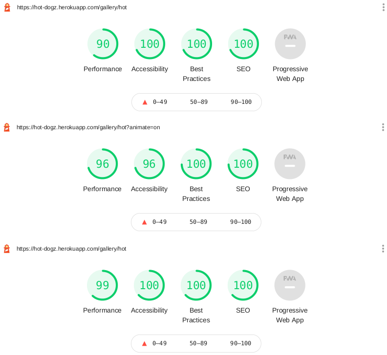
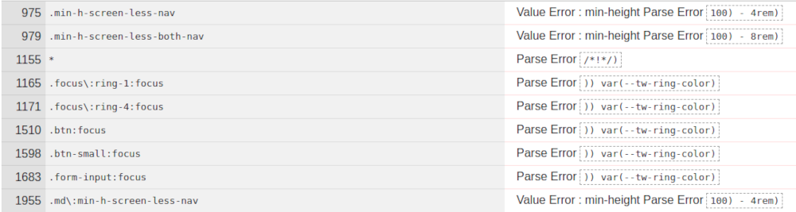
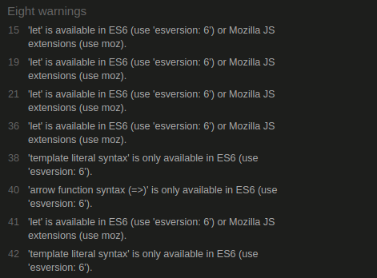

# Testing

## Table of Contents

  * [Functionality](#functionality)
    + [Navigation](#navigation)
      - [Navigation Bar](#navigation-bar)
    + [Main](#main)
      - [Landing Page](#landing-page)
      - [Gallery](#gallery)
      - [Contact](#contact)
    + [User Pages](#user-pages)
      - [Login / Register](#login---register)
      - [Avatar Selection](#avatar-selection)
      - [Reset Password](#reset-password)
      - [User Profile](#user-profile)
    + [Dog Pages](#dog-pages)
      - [Dog Page](#dog-page)
      - [Comments](#comments)
    + [Error](#error)
  * [Performance](#performance)
  * [Validators](#validators)
    + [HTML](#html)
    + [CSS](#css)
    + [JavaScript](#javascript)
  * [PEP8](#pep8)
  * [Compatibility](#compatibility)
    + [Hardware](#hardware)
    + [Browsers](#browsers)
  * [User Stories](#user-stories)
    + [New Visitor](#new-visitor)
    + [Repeat users](#repeat-users)
    + [All users.](#all-users)
    + [Website owner](#website-owner)
  * [Known Bugs](#known-bugs)
    + [Flask-Mail](#flask-mail)

<small><a href='http://ecotrust-canada.github.io/markdown-toc/'>Table of contents generated with markdown-toc</a></small>

## Functionality

### Navigation

- All links have been tested throughout the website with no broken links discovered
- Links throughout the website have hover and focus effects with no accessibiliity issuies arising in testing, either manually or through Lighthouse/dev tools
- On attempting to access links that reguire a user login, page will redirect to login screen and successfuly flash to user that login is required
- On attempting to access pages the user does not have permission to, user is successfully redirected to home and a flash explaining to user that they cannot access that page

#### Navigation Bar

- Navigation successfully shows correct nav items whether user is logged out / logged in
	- Logged out: Login, Register
	- Logged in: My Profile, Gallery, Upload, Contact, Logout
- On mobile screens (below 768px), navigation successfully switches from a 100% top navigation bar to a combination of top and bottom navigation (tested on both hardware and dev tools) 

### Main

#### Landing Page

- Landing page correctly displays:
	- Vertically, with text over the main image, if users are on a portrait viewport
	- Horizontally, with text to the left of the main image, on landscape viewports
- Landing page is successfully skipped if user is logged in, and any links leading to the landing page (such as the Hot Dogz icon in the top navigation) redirects to the main gallery page

#### Gallery

- Page successfully displays all images in a small image of fixed size 525x350px
	- This image successfully auto-crops to most 'interesting' part of image, decided by Cloudinary AI
- Page successfully displays a maximum of 6 dog cards per page
- Pagination successfully allows user to navigate between dog cards and see all uploaded dogs, beyond the initial 6 shown
- Page animation is successfully disabled for:
	- Pagination
	- Like
	- Save
- Liking a dog successfully increases it's count and alters its position in the displayed cards (if user has sorted by Hot)
- Saving a dog successfully adds that dog to a User's profile
- Dog cards correctly display different data depending whether current user has uploaded that dog
	- If yes: displayes links to edit & delete dog pages
	- If no: displays dog owner profile 

#### Contact

- Tested sending messages whilst logged in and as anonymous user
- When logged in, contact form has own registered email and username pre-filled
- Anonymous users can enter their own
- Messages successfully received in my own email
- Have successfully received messages by random registered users of the website

### User Pages

#### Login / Register

- Login & Register functionality has been extensively tested by both myself and real user sign-ups
	- as of writing this, there are 46 registered accounts with no reported issues of being unable to register or log in to the site
- Form validation works successfully, requiring
	- username between 2-12 characters
	- valid email address
	- matching passwords on registration
- Validation message for any form input errors are clearly displayed to the user  

#### Avatar Selection
- On initial register, user is successfully directed to avatar selection screen
- If user exits out of this without selecting an avatar, a random avatar will be assigned to them 

#### Reset Password
- Reset password has been tested as working on my own registered user accounts
- Email is sent from hotdogzapp@gmail.com
	- Reset password email *can* end up in the spam folder. This was discussed with mentor and was explained as a common issue when using services like Sendgrid with Gmail accounts. I added a flash advising users to check their spam folder to counteract this.
- Link to reset user password works whether link is clicked directly from email, or pasted into browser address bar
- Reset password requires matching password validation, with any error messages clearly given to user  

#### User Profile

- All user upload dog cards and saved dog cards display successfully on user profile page
- User can successfully edit own profile
	- Existing information is pre-filled into edit profile form
- User can successfully delete their own profile
	- Password confirmation is requested prior to deleting own profile
	- Deletion of a profile successfully deletes any associated dogs, along with any uploaded dog photos in admin's cloudinary account
	- Deletion of a profile successfully frees up that username and email for future user registration

### Dog Pages

#### Dog Page

- Dog image of fixed width 500px and original aspect ratio correctly displays on dog profile page
- Page correctly displays correct data depending on whether is a user owned dog:
	- if yes: edit and delete dog buttons
	- if no: text prompting visiting user to leave a comment

#### Comments

- Comments are input and saved successfully
	- Edit and delete comment buttons appear for current user comments
	- Previous comment content is prefilled for edit comment form
	- Confirmation is required before commend delete
- Comments are deleted on author profile deletion

### Error

- Successfully encountered 500 and 404 error pages during testing
- Back button successfully links user back to previous page

## Performance

- I tested site performance using Google Lighthouse within the Chrome Dev Tools
- Pages achieved consistent results across the website with 100% Accessibility, Best Practices and SEO
- Accessibility was affected by animation on the main gallery page, with Lighthouse initially detecting that 'Background and foreground colors do not have a sufficient contrast ratio.', however this issue was not present when gallery animation not active
- Full Reports:
	- [Mobile](docs/lighthouse/desktop_gallery_without_animation.pdf)
	- [Desktop (with animation)](docs/lighthouse/desktop_gallery_with_animation.pdf)
	- [Desktop (without animation)](docs/lighthouse/desktop_gallery_without_animation.pdf)
- Test Summaries: 
	- 

## Validators

### HTML

- Tested with [W3 HTML Validator](https://validator.w3.org/)
- Zero errors reported. Tested all pages that are accessible without user login:
:white_check_mark: [Homepage](https://validator.w3.org/nu/?doc=https://hot-dogz.herokuapp.com/)
:white_check_mark: [Main Gallery](https://validator.w3.org/nu/?doc=https://hot-dogz.herokuapp.com/gallery/hot?animate=on)
:white_check_mark: [Dog page](https://validator.w3.org/nu/?doc=https://hot-dogz.herokuapp.com/dog/60523b8c3283f343651f2f5c)

:white_check_mark: [Contact Page](https://validator.w3.org/nu/?doc=https://hot-dogz.herokuapp.com/contact)
:white_check_mark: [Login](https://validator.w3.org/nu/?doc=https://hot-dogz.herokuapp.com/login)
:white_check_mark: [Register](https://validator.w3.org/nu/?doc=https://hot-dogz.herokuapp.com/register)
:white_check_mark: [User Profile](https://validator.w3.org/nu/?doc=https://hot-dogz.herokuapp.com/profile/cjcon90)

### CSS

- Tested with [W3 CSS Validator](https://jigsaw.w3.org/css-validator/)
- There were errors and warnings found in the CSS validator due to tailwind compiling the output .css file and as such were not fully within my own control.
- CSS Validator found 9 errors:
	- 
	- These errors were linked to:
		- Tailwind's built in `ring` utility 
		- User defined utility classes in `tailwind.config.js`
	- All of the above pieces of code functioned as expected in the website
- Validator also found 125 warnings, linked to unknown vendor extensions

### JavaScript
- Tested with [JSHint](https://jshint.com/)
- JS file passed with the only feedback was regarding ES6 (let, const, =>, string literals etc):
- 

## PEP8
- PEP8 compliance was ensured through using [PyCharm](https://www.jetbrains.com/pycharm/) as a secondary IDE, and using its built in PEP8 validation functionality
- Compliance further tested with [PEP8 Online](http://pep8online.com/)
- Only raised issue was in `models.py` file which featured an [Continuation line over-indented for visual indent (E127) Error](https://www.flake8rules.com/rules/E127.html)
	- Indentation was necessary in keeping line length under 79 characters
	- Altering indentation did not remove error
	- Was not a critical error and was left in place 

## Compatibility

### Hardware

- Site was tested personally on:
	- Ubuntu 20.04 Laptop with 1920x1080 display
	- Windows 7 laptop with 1366x768 display
	- Google Pixel 4a 5G Android mobile with 2340x1080 display
- Site was tested by friends and peers with:
	- iPhone 8
	- Macbook Pro (unsure of model)
	- Surface Pro (unsure of model) 
- No hardware specific concerns were raised in any testing

### Browsers

- Site was tested personally on:
	- VIvaldi v3.7 (desktop)
	- Chrome v89 (desktop and mobile)
	- Firefox v87 (desktop) 
- Site was additionally tested by friends and peers with:
	- Safari (desktop & mobile)
- No browser specific concerns raised by any users
- **As site is built with Tailwind v2.0, it is not compatible with Internet Explorer**

## User Stories

### New Visitor
>I want to see the content of the website without being forced to register first

:white_check_mark: Gallery, dog pages and user profile pages are fully viewable without being logged in 
:white_check_mark: Interactions are clickable without being logged in, but it will prompt users to login/register screen on click

> I would like to easily register for the site.

:white_check_mark: Register link is clear to new viewers and form gives clear user validation messages
:white_check_mark: The login page links directly to the register page if user's do not already have an account
> I would like to be able to like and favourite photos on the site and easily understand how this system works

:white_check_mark: Like and favourite buttons use icons that are very common and familiar throughout social media sites
:white_check_mark: User feedback is given on both actions to confirm what action the user has performed
> I would like to be able to comment on photos

:white_check_mark: User can comment on their own photos and other user's photos
:white_check_mark:  A prompt is given on other user's dog pages pages for users to enter a comment
> I would like to add my own dogs to the site

:white_check_mark: User can upload their own photos and ths has been tested extensively, with the user's photos going in an organised folder within cloudinary

### Repeat users

> I would like to easily login upon opening the site.

:white_check_mark: Register link is clear to new viewers
:white_check_mark:  Register form gives clear user validation messages
> I would like to see my saved favourites and previous uploads

:white_check_mark: User uploads and saved items are prominently displayed with clear headings on the user profile page denoting each section
> I would like to be able to edit/delete my comments

:white_check_mark: Edit and Delete buttons are clearly visible on a user's own posts
:white_check_mark: confirmation is requested before deletion occurs.
> I would like to edit and delete my posts

:white_check_mark: User uploads are fully editable in terms of dog's name, photo, breed and about section.
:white_check_mark: When a user uploads a new photo, it successfully replaces the previous dog photo within the database
:white_check_mark: Confirmation is requested before deleting any uploaded dogs

> I would like to be able to edit and delete my account

:white_check_mark: Account is fully editable in terms of name, email address, password
:white_check_mark: User can access the user avatar selection page any time to change their selected avatar
:white_check_mark: Confirmation is requested, along with a password request, to delete user profile
:white_check_mark: On profile deletion, all user uploads and comments are deleted, as well as any user photos within the Cloudinary database

### All users.

> I would like to get feedback when I have completed an action on the site.

:white_check_mark: User is given feedback for all actions on the site through the use of Flask flashes
:white_check_mark: Flashes are given a different color and icon to represent the type of notification
:white_check_mark: There is no flash for **un**-liking or saving a dog, but this a stylistic choice to not overload the user with notifications. User would al;ready have an understanding of the function from previous flash message, and feedback is given through the thumbs up / heart icon turning grey 
> I would like to be able to contact the website owners

:white_check_mark: Contact Us features amongst the navbar items once users have logged in
:white_check_mark:  Username and email are pre-filled for logged in users to ensure correct details are sent and to make process easier
:white_check_mark:  A contact us link is clearly visible on both the login & register pages for users that have not logged in or registered

### Website owner

> I want the website to be fun and enjoyable for the user

:white_check_mark:  User testing feedback has been very positive in terms of the fun and enjoyment in the website, particularly due to the quirky user avatars, funny background images and the actual user photos content of the website
> I want the user to be able to sign up or log in easily

:white_check_mark:  No issues were reported during testing rehgarding sign up or login (as of writing this there are 46 total registered accounts with the website, estimate that 40 of those were not created by me)
> I want users to be able to easily recover their account if they have lost their login details

:white_check_mark:  I have extensively tested the password reset function
:heavy_exclamation_mark: Emails from hotdogzapp@gmail.com can end up in the spam folder. This was discussed with mentor and was explained as a common issue when using services like Sendgrid with Gmail accounts. I added a flash advising users to check their spam folder to counteract this.

> I only want users to be able to edit/delete their own content

:white_check_mark:  Any user that enters a URL for editing or deleting another person's content will be redirected back to home page with an warning flash alerting that user cannot delete or edit content belonging to another person
> I want the ability as admin to delete/edit any content that is inappropriate

:white_check_mark: There is a special login 'admin' that has privileges to edit or delete any content on the website. Differences in the admin view can be seen here:

## Known Bugs

### Flask-Mail
- Flask-Mail functions fine locally but is not functioning properly on Heroku App, and provides the following error:

> smtplib.SMTPNotSupportedError: SMTP AUTH extension not supported by server 

- Despite attempts at solving this bug online, and ensuring that my environment variables, port settings etc were correct, I decided that best way to resolve was to use a third party app within Heroku, [Twilio SendGrid](https://devcenter.heroku.com/articles/sendgrid)
- This has ensured that mail for Contact Form and Password Reset is working, although as noted earlier it can end up in Spam folder
	- In discussion with mentor, this is a known issue with using mail services and Gmail