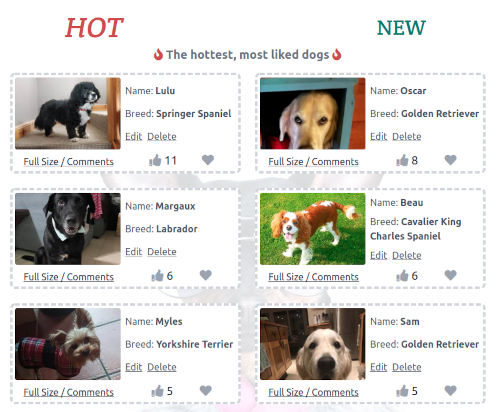
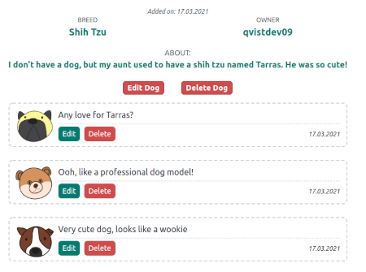

## Testing

### User Stories

#### New Visitor
>I want to see the content of the website without being forced to register first

:heavy_check_mark: Gallery, dog pages and user profile pages are fully viewable without being logged in 
:heavy_check_mark: Interactions are clickable without being logged in, but it will prompt users to login/register screen on click

> I would like to easily register for the site.

:heavy_check_mark: Register link is clear to new viewers and form gives clear user validation messages
:heavy_check_mark: The login page links directly to the register page if user's do not already have an account
> I would like to be able to like and favourite photos on the site and easily understand how this system works

:heavy_check_mark: Like and favourite buttons use icons that are very common and familiar throughout social media sites
:heavy_check_mark: User feedback is given on both actions to confirm what action the user has performed
> I would like to be able to comment on photos

:heavy_check_mark: User can comment on their own photos and other user's photos
:heavy_check_mark:  A prompt is given on other user's dog pages pages for users to enter a comment
> I would like to add my own dogs to the site

:heavy_check_mark: User can upload their own photos and ths has been tested extensively, with the user's photos going in an organised folder within cloudinary

#### Repeat users

> I would like to easily login upon opening the site.

:heavy_check_mark: Register link is clear to new viewers
:heavy_check_mark:  Register form gives clear user validation messages
> I would like to see my saved favourites and previous uploads

:heavy_check_mark: User uploads and saved items are prominently displayed with clear headings on the user profile page denoting each section
> I would like to be able to edit/delete my comments

:heavy_check_mark: Edit and Delete buttons are clearly visible on a user's own posts
:heavy_check_mark: confirmation is requested before deletion occurs.
> I would like to edit and delete my posts

:heavy_check_mark: User uploads are fully editable in terms of dog's name, photo, breed and about section.
:heavy_check_mark: When a user uploads a new photo, it successfully replaces the previous dog photo within the database
:heavy_check_mark: Confirmation is requested before deleting any uploaded dogs
> I would like to be able to edit and delete my account

:heavy_check_mark: Account is fully editable in terms of name, email address, password
:heavy_check_mark: User can access the user avatar selection page any time to change their selected avatar
:heavy_check_mark: Confirmation is requested, along with a password request, to delete user profile
:heavy_check_mark: On profile deletion, all user uploads and comments are deleted, as well as any user photos within the Cloudinary database

#### All users.

> I would like to get feedback when I have completed an action on the site.

:heavy_check_mark: User is given feedback for all actions on the site through the use of Flask flashes
:heavy_check_mark: Flashes are given a different color and icon to represent the type of notification
:heavy_check_mark: There is no flash for **un**-liking or saving a dog, but this a stylistic choice to not overload the user with notifications. User would al;ready have an understanding of the function from previous flash message, and feedback is given through the thumbs up / heart icon turning grey 
> I would like to be able to contact the website owners

:heavy_check_mark: Contact Us features amongst the navbar items once users have logged in
:heavy_check_mark:  Username and email are pre-filled for logged in users to ensure correct details are sent and to make process easier
:heavy_check_mark:  A contact us link is clearly visible on both the login & register pages for users that have not logged in or registered

#### Website owner

> I want the website to be fun and enjoyable for the user

:heavy_check_mark:  User testing feedback has been very positive in terms of the fun and enjoyment in the website, particularly due to the quirky user avatars, funny background images and the actual user photos content of the website
> I want the user to be able to sign up or log in easily

:heavy_check_mark:  No issues were reported during testing rehgarding sign up or login (as of writing this there are 46 total registered accounts with the website, estimate that 40 of those were not created by me)
> I want users to be able to easily recover their account if they have lost their login details

:heavy_check_mark:  I have extensively tested the password reset function
:heavy_exclamation_mark: Emails do tend to end up in the spam folder. This was discussed with mentor and was explained as a common issue when using services like Sendgrid with Gmail accounts. I added a flash advising users to check their spam folder to counteract this

> I only want users to be able to edit/delete their own content

:heavy_check_mark:  Any user that enters a URL for editing or deleting another person's content will be redirected back to home page with an warning flash alerting that user cannot delete or edit content belonging to another person
> I want the ability as admin to delete/edit any content that is inappropriate

:heavy_check_mark: There is a special login 'admin' that has privileges to edit or delete any content on the website. Differences in the admin view can be seen here:

